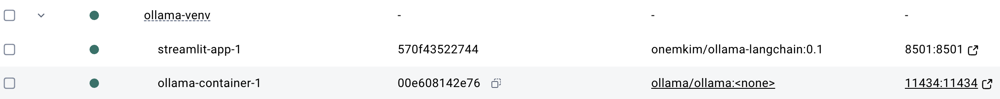

Reference:
- https://abvijaykumar.medium.com/ollama-build-a-chatbot-with-langchain-ollama-deploy-on-docker-5dfcfd140363
- https://github.com/abvijaykumar/ollama-langchain/tree/main
- More complicated reference: https://github.com/valiantlynx/ollama-docker/blob/main/README.md


## Tutorial

1. Create ollama-venv virtual env.
``` sh
python3 -m venv ./ollama-venv
source ./ollama-venv/bin/activate
cd ./ollama-venv
```

2. Create app.py file
3. Create Dockerfile
4. Run docker daemon (docker desktop)
5. Build docker image of ollama-langchain
``` sh
#
docker build . -t onemkim/ollama-langchain:0.1

# check if the Docker image is built, using docker images command
docker images

# View a summary of image vulnerabilities and recommendations: https://github.com/docker/scout-cli 
docker scout quickview 
What's next:
    View vulnerabilities → docker scout cves local://onemkim/ollama-langchain:0.1
    View base image update recommendations → docker scout recommendations local://onemkim/ollama-langchain:0.1
    Include policy results in your quickview by supplying an organization → docker scout quickview local://onemkim/ollama-langchain:0.1 --org <organization>

```

6. Create docker-compose.yml file
- update volume location of ollama repo

7. Run docker compose
``` sh
docker compose up
docker compose ps
```
8. Check the result
```
http://localhost:11434/  for ollama
http://0.0.0.0:8501/ for streamlit
```

9. Run ollama with phi
``` sh
# run this command in same directory with docker compose file
docker exec -it ollama-venv-ollama-container-1  ollama run phi
```

10. Everything is ready. Go to http://0.0.0.0:8501/ and use it..
    
## Others
### Size of imageso
- pnemkim/ollama-langchain: 1.59GB
- ollama/ollam: 4.76G


